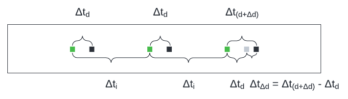

# Measuring the One-Way Speed Of Light

<picture>
  
</picture>
<picture>
  
</picture>
  

***No clocks needed!*** Just two *independent* timers.

Alright, timers *are* clocks, but what matters is that *they do not need to be synchronized*.

### Summary
- Laser pulses are fired towards a photodetector at a regular interval.
- A timer attached to the photodetector measures the amount of time between the reception of the laser pulses (in a similar fashion to a heartbeat monitor).
- As the Earth (or some other frame of reference) rotates, the light/laser pulses travel towards the photodetector in different directions.
- If the one-way speed of light is constant, the time intervals measured by the photodetector will also remain constant (no variation between any of the measurements).
- However, if the one-way speed of light varies depending on the direction, then the time intervals measured by the photodetector will vary as well (they will get shorter if the light is travelling faster, and longer if the light is travelling slower). We could then explore this phenomenon further (more on this below).

### Definitions
- The term '**round-trip speed of light**' refers to the average speed of light across a closed circuit (from and back to the source in either direction), which is the known constant *c* (299,792,458 m/s).

- The term '**direction**' refers to absolute directions in a fixed universal frame (not using the earth or the sun as anchors, but rather the entire universe).
  - In that sense, if a laser is pointing in a fixed direction in reference to the earth, its direction is gradually changing in reference to the universe. You can imagine pointing "east" (which is a fixed direction in reference to the earth); but in reference to the universe, that direction is always changing (sometimes it's pointing towards the sun, sometimes towards the moon, and sometimes towards various stars).
  - Conversely, if a laser is pointing in a fixed direction in reference to the universe, its direction is gradually changing in reference to the earth. You can imagine pointing towards a star in the sky (which is relatively fixed over a short span of time); but in reference to an observer on the surface of the earth, the direction of that star is always changing.
  - These universal directions could be likened to the fixed directions of an aether frame, likening the search for a change in the one-way speed of light to the search for an aether wind ([which has already been disproven](https://en.wikipedia.org/wiki/Luminiferous_aether), albeit using the round-trip speed of light). Nevertheless, the ability to experimentally measure the one-way speed of light remains disputed.

- All times will use the second as their unit.

- All lengths & distances will use the light-second as their unit.

- All speeds will use light-seconds per second as their unit.

### Installation
The setup is extremely simple (see figure 1):
- First, we'll need a vacuum tube/chamber (because we want to measure the one-way speed of light *in a vacuum*).
- At one end of the tube, install a laser with a timer, and configure the timer to trigger a short laser pulse at a regular interval.
- At the other end of the tube, install a photodetector with a timer (or some other device to record the time interval between each activation of the photodetector by the laser pulses).
- This setup doesn't even require meticulous installation; what really matters is its reliability/invariability (that the measurements be constant under fixed/unvarying conditions), and that external disturbances be minimized.

<picture></picture>
 <em>Figure 1</em> 

### Experiment 1: Measuring the one-way speed of light
Since we can't measure the one-way speed of light like that of any other moving object (i.e. by measuring its velocity), we have to find a different approach. One way could be to transfer the measurement of the speed onto the axis of time alone, allowing us to measure speed as an interval/delta between two points in time, rather than using a plane of space across time to measure speed as a distance travelled in space over an amount of time.

By measuring the distance between two points in time, we can measure the time taken by light to traverse a given distance. We can imagine these measurements being recorded on a long strip of paper, which is moving along at a constant speed.

Thus, going forward, the photodetector and its timer will instead be represented by such a strip/roll of paper that is unrolling at constant speed, not unlike an old seismic detector (see figure 2):
- When a laser pulse hits the photodetector/strip of paper, it leaves a black mark on the paper.
- Green marks are used to indicate when the laser pulse was initially fired, relative to the black marks.
  - These marks are imaginary, since it's impossible to tell from this end when the laser was fired without synchronized clocks, and it's impossible to synchronize clocks without knowing the one-way speed of light (which is what we're trying to determine).
- The distance between the laser and the photodetector is designated as the letter **d**.
- The distance between the green mark and the black mark is the time it took for the laser pulse to reach the photodetector (designated as **Δtd**).

<picture></picture>
 <em>Figure 2</em> 

If we let the laser fire a few times, the photodetector should register these readings at the exact same interval (see figure 3):
- This time interval is designated as **Δti**.

<picture></picture>
 <em>Figure 3</em> 

One way to measure the one-way speed of light in a specific direction would be to then move the laser (or the photodetector), and measure the impact it has on the subsequent time interval measured by the photodetector (see figure 4):
- The distance of the movement is designated as **Δd**.
- The time interval measured by this new distrance is designated as **Δt(d+Δd)**

<picture></picture>
 <em>Figure 4</em> 

We can then observe that **Δt(d+Δd)** is greater than **Δtd**, which is expected since the distance travelled by the light is greater (see figure 5).
- A gray mark is used to indicate when the laser pulse would have been normally received (if there had been no movement).
- The difference between **Δtd** & **Δt(d+Δd)** could then be easily calculated using simple subtraction (**Δt(d+Δd) - Δtd**), and designated as **ΔtΔd**.
  - ***However, we do not know these values, since we do not know when the laser pulse was fired*** (which would require synchronized clocks).

<picture></picture>
 <em>Figure 5</em> 

Let's see if there might be another way to calculate **ΔtΔd**. The only value that is available to us is **Δti**; let's see if we could use it instead. We can observe that **Δti** remains constant for the laser, *but not for the photodetector* (see figure 6). As we already know, that's because the distance travelled by the light has increased (and thus the time taken to reach the photodetector).
- Let's designate this new time interval as **ΔtiΔd**.
- Note that **ΔtiΔd** can only be measured once per movement, as the subsequent time intervals will return to the original value (**Δti**), and remain constant from thereon.
- **ΔtΔd** can then be easily calculated by once again using simple subtraction (**ΔtiΔd** - **Δti**).

<picture></picture>
 <em>Figure 6</em> 

We've now measured the time it takes (**ΔtΔd**) for light to travel a certain distance (**Δd**) ***in one direction***! From there, we can easily calculate the one-way speed of light (in that direction) using the division of the distance travelled by the time elapsed (**Δd / ΔtΔd**).

That's it! We've done it! ...or have we?

There are two problems with this approach:
- First, time dilation comes into play with any movement of an object/timer/clock. Even though we could account for it, it would be difficult to determine with absolute certainty which proportion of **ΔtΔd** comes from **Δd**, and which proportion comes from time dilation (although time dilation should represent a significantly smaller portion).
- Moreover, the earth is rotating, so from one moment to the next, a stationary laser is never really pointing in the exact same direction (the direction will change by about 0.004˚ per second if the laser is parallel to the equatorial plane).

This gives us three variables to consider:
- The change in distance (**Δd**);
- Time dilation;
- And the rotation of the earth (a change in direction).

The rotation of the earth is an interesting problem: without doing anything or modifying the conditions of the experiment in any way, it results in laser pulses being sent in gradually different directions. This allows us to measure the time interval required for the light to reach the photodetector in each of those directions, and compare these time intervals with each other. This is actually good news! We may not be able to precisely *measure* the one-way speed of light because of time dilation and the rotation of the earth, but we can measure *relative* changes in the one-way speed of light between different directions, without moving any objects (simply relying on the rotation of the earth).

Since nothing is moving, there is no change in distance to consider, and we can also eliminate time dilation as a variable. This leaves the rotation of the earth/direction of the light as the only thing that can alter the time intervals. But that is only if the one-way speed of light is not constant in every direction. If it is constant, then the time intervals (**Δti**) will never vary.

### Experiment 2: Measuring the *relative* one-way speed of light in different directions
The most obvious question at this point is: does the one-way speed of light vary in different directions, or is it constant in every direction?

We can answer that question with another experiment: simply perform experiment 1, but without moving anything, and collect measurements over a period of 24 hours (a full rotation of the earth). Avoid making the laser parallel to the earth's axis, as that wouldn't produce any change in its direction.

If the one-way speed of light is constant in every direction, then the measured time intervals should never vary.

But what can we expect if the one-way speed of light is not constant in every direction? Could we build a model of the possible variations to expect? Indeed we could, and this is what [appendix A](appendix-a.md) demonstrates.

But how could we use this model to actually calculate the one-way speed of light in various directions? As appendix A concludes, it should be possible to mathematically derive the one-way speed of light in every direction of a given plane by using two perpendicular lasers, and in every three-dimensional directions by using three perpendicular lasers (see figure 7). Lasers could also be installed in the opposite directions (so four or six lasers in total) in order to confirm the inverse proportionality of the speed of light, or more usefully to validate the measurements taken in opposite directions (they should vary proportionally: if one becomes faster, the other should become proportionally slower).

<picture></picture>
 <em>Figure 7</em> 

Best of all: three perpendicular measuring devices would very quickly provide certainty on whether or not the one-way speed of light varies at all. It would be like measuring the radius of an egg in three perpendicular directions: we are guaranteed to get at least one measurement that differs from the others, and very likely to get three completely different measurements. But if all three measurements always remain the same, we are dealing with a sphere.

Thus, if we don't observe any variation in the time intervals (**Δti**), then there is nothing to calculate; we can conclude that the one-way speed of light is constant (`c` in every direction), and the experiment ends there.

However, if there are variations, we could use those relative changes to calculate the one-way speed of light in one direction in proportion to the one-way speed of light in another direction. To do so would require a baseline/starting point, and since appendix A demonstrate that there must always be a plane where the one-way speed of light is equal to the round-trip speed of light, all we would have to do is to locate this plane. But how should we go about doing that?

### Expected results
Figure 8 below shows five generalized results we should expect to observe in the variation of the one-way speed of light around a given plane (after 360˚ of rotation) for one single measuring device. The variations have been greatly exaggerated for demonstration purposes, in order to highlight the expected results:

- In result #1, the measured time interval does not vary at all, and thus the one-way speed of light must be constant in every direction of that plane.

- In result #2, the first measurement is taken along the axis/plane where the one-way speed of light is equal to the round-trip speed of light.
  - Afterwards, the time intervals start to decrease until a peak is reached; that is the direction in which the one-way speed of light is the fastest (in that plane), which should be perpendicular to the starting direction (after 90˚ of rotation).
  - Then, the time intervals start to increase until they reach a point where they are equal to the initial time interval; that is along the axis along which the one-way speed of light is equal to the round-trip speed of light, which should be the opposite of the initial direction (after 180˚ of rotation).
  - Then, the time intervals continue to increase until another peak is reached; that is the direction in which the one-way speed of light is the slowest (in that plane), which should be perpendicular to the starting direction (after 270˚ of rotation), and the opposite of the direction in which the one-way speed of light is the fastest.
  - Finally, the time intervals start to decrease again until we're back to the initial direction (after 360˚ of rotation).

- Result #3 is the opposite of result #2: the time intervals initially start to increase rather than decrease.

- In result #4, the first measurement is taken along the axis/plane where the one-way speed of light is the slowest.
  - Afterwards, the time intervals start to decrease until a peak is reached; that is the direction in which the one-way speed of light is the fastest (in that plane), which should be the opposite of the starting direction (after 180˚ of rotation).
  - Then, the time intervals start to increase until we're back to the initial direction (after 360˚ of rotation).
  - We can deduce that the axis along which the one-way speed of light is equal to the round-trip speed of light is perpendicular to those two directions (after 90˚ and 270˚ of rotation), and the measurements should confirm this (the time intervals should be equal).

- Result #5 is the opposite of result #4: the first measurement is taken along the axis/plane where the one-way speed of light is the fastest, and the time intervals start to increase rather than decrease.

<picture></picture>
 <em>Figure 8</em> 

Using such results, locating the axis/plane where the one-way speed of light is equal to the round-trip speed of light isn't a difficult task. And once we've located it, we can then calculate the one-way speed of light in every other direction from the changes in the time intervals, which correspond to relative changes in the one-way speed of light. For example, if the time interval in a given direction is 20% shorter than the baseline, then the one-way speed of light is 20% faster in that direction (relative to the round-trip speed of light), and vice versa.

### The ideal environment
The ideal environment to carry out such an experiment could be existing large-scale interferometers, such as the ones at [LIGO](https://en.wikipedia.org/wiki/LIGO) (because they are optimized to minimize external disturbance to the system). But instead of reflecting a laser, photodetectors at the end of each arm could record the time intervals between laser pulses. In addition, the results from each arm could then be compared with each other (since each one would represent changes in different direction).

Additionally, greater distances make for higher precision measurements, so those 4 kilometer arms would allow for a very high degree of precision. Of course, this depends on how much variation we're trying to detect, and on the precision of the timers/clocks. With extremely precise timers, 4 kilometers is probably more than necessary.

### On using the earth's rotation
There is one catch with relying on the earth's rotation to measure the one-way speed of light around an entire flat plane: the best way to do so is to angle the laser to be parallel to the equator.

  - If the laser is instead angled to be parallel to the earth's axis of rotation, it would create the shape of a cylinder, effectively only testing a single direction, and thus should show no changes in the measurements as there is no variation in direction, which defeats the purpose of running the experiment in the first place (unless the measurements do show a variation, which would be very surprising).

  - Any other angle would result in the rotation of the laser creating the shape of a cone, although such a cone could be "flattened" into a disk/circle by ignoring its height (just as any conical cut of an egg can be visualized as a flat plane by drawing the circle where the cut meets the surface of the egg).

But we don't need to depend on the rotation of the earth to perform these experiments. The earth is a three-dimensional rotating frame of reference, but we could also use:

- A very precisely measured disk/carousel/rotating table, with the laser & photodetector placed at the exact same distance from the center. This two-dimensional plane would be our flat rotating frame of reference.

- Or a tube with a rotation mechanism fixed to the exact center (between the laser and the photodetector). This one-dimensional axis would be the frame of reference, and rotating it would replicate a flat plane (just like a disk/carousel with the laser & photodetector placed on opposite sides).

Of course, this only works as long as all the objects maintain the same distance from the center of the earth, in order to avoid the effects of gravitational time dilation. But since we're only comparing measurements relative to previous measurements *from the same device*, we only need to ensure that any time dilation remains constant for each individual device over time. This means that we could install multiple lasers along perpendicular axes (as shown in figure 7), and rotate them around the point where they intersect, each one maintaining the same distance from the center of the earth (but that distance could be different for each one of them).

My appartment building has a table that very effectively demonstrates this design (see figure 9).
- All 6 arms are perpendicular.
- Each one has an opposite (another arm pointing in the opposite direction).
- Lasers could be fired from the center of the structure towards photodetectors at the end of each arm.
- Rotating this design around the vertical axis would produce a change in direction for each arm, while maintaining the same distances from the center of the earth.
- And it wouldn't need to be rotated very fast, in order to minimize mechanical disturbances.

Time will pass slightly faster for the three arms at the top, but that time will never be compared against the time of the three arms at the bottom; only their measurements will be compared: measurements recording the relative changes in the one-way speed of light along each individual arm over time, as its direction changes.

<picture></picture>
 <em>Figure 9</em> 

As every possible perpendicular configurations are implemented in this design (each arm is perpendicular with 4 others), we can be absolutely certain to detect any variation in the one-way speed of light in any direction (as per the model described in appendix A).

- This would ensure that we do not miss any variations, such as would be possible if we only tested a two-dimensional plane (which could be the perfectly circular plane of the ovoid/egg, as statistically unlikely as that is).

- From these six relative measurements, we would be able to trigonometrically calculate the one-way speed of light in every other possible direction by finding the constant plane (the one where the one-way speed of light is equal to the round-trip speed of light), along with its perpendicular axis (the one with the greatest & lowest speed), and drawing out the resulting ovoid or sphere.

- We would also be able to compare the measurements taken in opposite directions in order to validate that they vary proportionally (if one becomes faster, the other should become proportionally slower), which could also be a good way to validate our instruments/installation.

## Acknowledgements:
Thanks to [Dr. Derek Muller](https://en.wikipedia.org/wiki/Derek_Muller) (creator of [Veritasium](https://www.veritasium.com/)), for [sharing this issue with the world](https://www.youtube.com/watch?v=pTn6Ewhb27k) (and for [all of his amazing videos](https://www.youtube.com/c/veritasium))!

<picture>
  
</picture>
<picture>
  
</picture>
