# Measuring the One-Way Speed Of Light

<picture>
  
</picture>
<picture>
  
</picture>
  

### Appendix A - Modeling the one-way speed of light

What can we expect in the measurements of the relative one-way speed of light if it isn't constant in every direction?

There are some rules/laws of physics we can use:
- The well-known round-trip speed of light (299,792,458 m/s). This has already been proven many times.
- The corresponding inversely proportional relationship between the speed of light in opposite directions: in order to maintain the same round-trip time, if the light travels faster in one direction, it must travel proportionally slower in the opposite direction.
  - To calculate the inverse of a given one-way speed of light **x**, we can use this equation: **y(x) = 1 / (2 - 1/x)**
- The laws of angles & trigonometry.
- The laws of motion: at constant speed, the time taken by light to travel given distances (in the same direction) is proportional to the distance (i.e. travelling twice as far will take twice as long). Basically, **time elapsed = distance travelled / speed**.

How can we make use of these rules to build a model?

Let's start with an equilateral triangle (see figure 1):
- To keep things simple, let's use light-seconds as a unit.
- The height (**h**) can be calculated using this equation: **h = a × √3 / 2**.
- If the sides of the triangle have a length of 1 light-second, then the height of the triangle is **√3 / 2** light-seconds.
- It would take three seconds for light to travel through this triangle (in either direction).

<picture>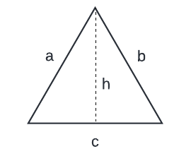</picture>
 <em>Figure 1</em> 

From there, we can modify the triangle and use the laws of trigonometry to keep track of its dimensions (see figure 2):
- If we keep side **b** fixed, we can establish a trigonometric relationship between sides **a** and **c**.
- To simplify things, we can use **h** instead of **b** (which will not change if **b** is fixed) to establish this relationship.
- What we want to do is determine the length of **a** based on a given length of **c**, which we can easily do using the Pythagorean theorem: **c2 + h2 = a2**.
- Except in this case, we must subtract 0.5 from **c** (half of its initial length), since we are using **h** instead of **b** to calculate the length of **a**.
- Thus, the length of **a** can be calculated using the following equation: **a = √((c - 0.5)2 + (√3 / 2)2)**.
- The perimeter of the entire triangle can be calculated using the following equation: **D = a + b + c**, which is: **D = √((c - 0.5)2 + (√3 / 2)2) + 1 + c**.
- This configuration allows us to explore nearly 120˚ of changes in direction between **c = 0** & **c** nearning infinity.
- Nearly 180˚ of changes in direction could be explored if we minimized the angle between **b** & **c**, which we could do by shrinking **h** (the height of the triangle, which is currently set to **√3 / 2**), or by elongating the portion of **c** which is on the right size of **h** (which is currently set to 0.5).

<picture>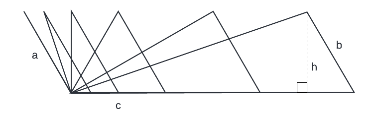</picture>
 <em>Figure 2</em> 

Next, we want to determine how long it would take for light to travel through **a** based on a given length of **c** and a given one-way speed of light through **c**:
- The basic equation for the time light takes to travel through a given triangle is: **T = ta + tb + tc**, where **ta** is the time light takes to travel through side **a**, and so on.
- To keep things simple for now, since **b** is fixed to 1 light-second, let's also fix **tb** to 1 second.
- **D** gives us a distance in light-seconds, and **T** gives us a number of seconds required for light to travel through a given triangle. Using **time elapsed = distance travelled / speed** with an average speed of 1 light-second per second, we can consider that **D = T × 1**, or **T = D / 1**.
- Basically, **D** gives us how long the light *should take* to travel through the triangle (based on the round-trip speed of light), while **T** gives us how long the light is *actually taking* to travel through the triangle (also based on the round-trip speed of light, but more specifically *based on the time it takes to travel through each side*), which allows us to extract one of those sides (**ta**) and calculate how it varies based on changes in speed and distance through one of the other sides (**tc**).
- Thus, we can form an equality with the two equations above: **ta + 1 + tc = √((c - 0.5)2 + (√3 / 2)2) + 1 + c**.
- Then, we can isolate **ta**: **ta = √((c - 0.5)2 + (√3 / 2)2) + 1 + c - 1 - tc**.
- And finally, we can express **tc** as the time elasped to travel a certain distance (**c**) at a given speed (**s**): **tc = c / s**.
- This gives us our final equation: **ta = √((c - 0.5)2 + (√3 / 2)2) + 1 + c - 1 - c/s**.
- Which we can instead express as a function of **x** (by replacing **c** for **x**): **y(x) = √((x - 0.5)2 + (√3 / 2)2) + 1 + x - 1 - x/s**.
- And at last, we can graph the equation above with **s** substituted for various different speeds (multipliers of the round-trip speed of light) between 0.5 and ∞ (see figure 3).

<picture>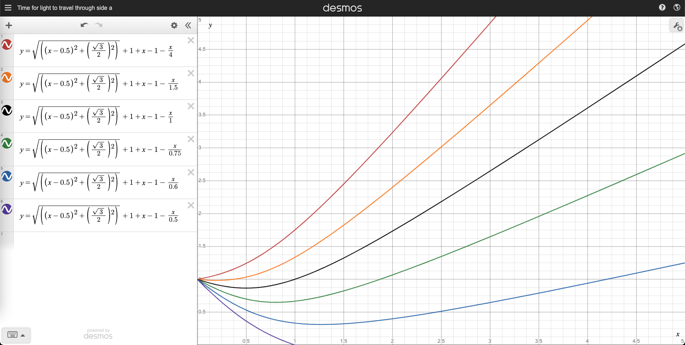</picture>
 <em>Figure 3</em> 

What observations can we make from this graph?
- All the curves start at 1.
  - This is good, and confirms the expectation that when the length of **c = 0**, then we are not working with a triangle, but with a straight line (as shown in figure 2). The light travels through **a** and then back through **b**, so it must travel through **a** in 1 second in order to conform to the round-trip speed of light (total elapsed time of 2 seconds).
  - Basically, for the total elapsed time to be of **T = 2 seconds**, if **tb = 1 second** & **tc = 0 seconds** (since its length is 0), then it must be that **ta = 1 second**.

- The last curve ends at **y = 1** (the one where the speed of light through **c** is half the speed of light).
  - This is also good, and confirms the expectation that when the length of **c = 1** (creating our original equilateral triangle), the speed of light through **a** must be infinite (travel time of 0 seconds).
  - Basically, for the total elapsed time to be of **T = 3 seconds**, if **tb = 1 second** & **tc = 2 seconds** (half the speed of light), then it must be that **ta = 0 seconds**.
  - After that point, since the length of **b** is fixed to 1, and **c** is the longest side of the triangle with the lowest speed of light possible, there is no possible speed at which the light can travel through **a** to satisfy the round-trip speed of light (unless it travels back in time, hence the curve disappearing below 0).

- All the curves eventually start increasing linearly (except when the speed of light through **c** is half the speed of light).
  - This is good, and confirms the expectation that when the length of **c** increases, so does the length of **a**, and the time it takes for the light to travel through **a**.

- The curves increase faster when the speed of light through **c** is high (and conversely when it is low).
  - This is good, and confirms the expectation that the higher the speed of light through **c** is, the lower it must be through **a**, resulting in longer travel times through **a**.

- Before the curves start increasing, they first decrease (except when the speed of light through **c** is high, in which case the curves start increasing immediately). There are many reasons for this:
  - First, the length of **c** is initially very short (0), but the length of **a** starts at 1 (to match the length of **b**).
  - The length of **a** doesn't increase as rapidly as the length **c**, since **c** is the hypothenuse of the triangle.
  - More importantly: the length of **a** decreases until **c = 0.5** (at which point the length of **a = √3 / 2**), and then starts increasing again. Once **c** reaches a length of 1, the length of **a** reaches 1 as well. We can observe this in the black curve (where the speed of light through **c = 1**), as the time elapsed is equal to the distance travelled (length of **a**).

All this is interesting, but it doesn't anwser our initial question. Where do we go next?

Instead of graphing the time it takes for light to travel through **a**, let's try graphing the speed of light through **a** (see figure 4):
- Let's remember that as the length of **c** increases, so does the length of **a**. But more importantly: the direction of **a** changes. This will thus allow us to calculate & observe the speed of light in those various directions (i.e. based on the decreasing angle between **a** & **c**).
- We can use the standard speed formula to do so: **speed = distance travelled / time elapsed**. We already have the time elapsed, which is the previous formula used in figure 3, so let's divide the length of **a** (which we already know) by that formula, giving us: **y(x) = √((x - 0.5)2 + (√3 / 2)2) / (√((x - 0.5)2 + (√3 / 2)2) + 1 + x - 1 - x/s)**.

<picture>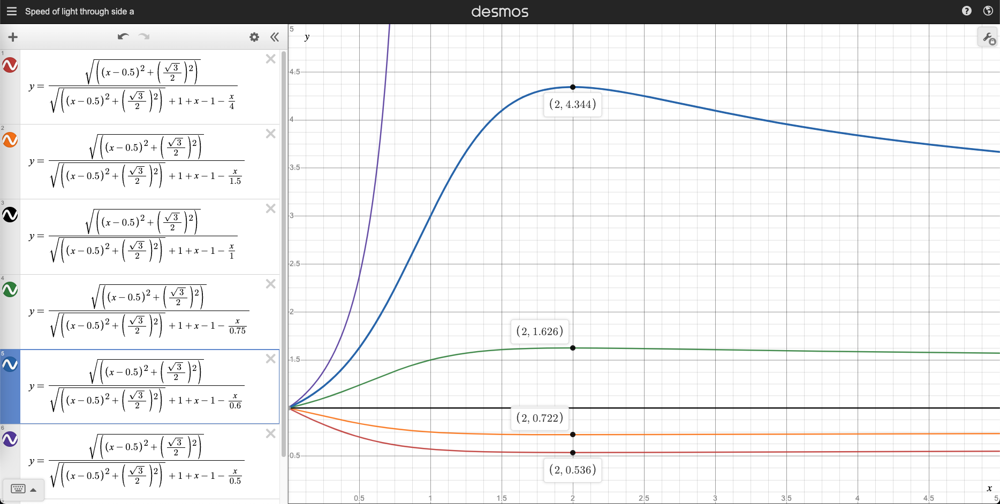</picture>
 <em>Figure 4</em> 

What observations can we make from this graph?

- The black curve is flat (the one where the speed of light through **c = 1**).
  - This is as expected, since when the speed of light through both **b** & **c** is 1, it must also be 1 through **a**.

- At **x = 1**, the one-way speed of light through **a** is the exact inverse of the one-way speed of light through **c**.
  - This is good, and confirms the expectation that when **a** & **c** are of the same length (forming an equilateral triangle), their speeds should be the inverse of each other within the same circuit (and swapped in the reversed circuit, due to the inversely proportional relationship between them), since the speed of light through **b** has been fixed to 1.
  - And for the purple curve (the last equation), since the speed through **c** has been set to 0.5, the speed through **a** righly reaches infinity, and appears as an asymptote in the graph.

- As **x** increases (past the peak at **x = 2**), the speed of light through **a** gradually gets closer & closer to the inverse of the speed of light through **c**.
  - This is good, and confirms the expectation that as **c** gets longer, and the angle separating them shrinks, **a** become closer & closer to being parallel with it (although it will never be, since **b** will always separate the two), and thus the speed through **a** gradually approaches the inverse of the speed through **c**.

But most importantly, something very interesting is emerging here: all the curves peak at **x = 2**, which is when the length of **c** is 2 (except in the curve where the speed of light approaches infinity, which has an asymptote at **x = 1**). What is so special about that configuration? Let's draw it out (see figure 5):

- First, we already know that the length of **b** is fixed at 1.
- Second, we want to look at the triangle when the length of **c** is 2.
- Third, we can calculate the length of **a** based on the existing equation, substituting 2 for **x**: **√((2 - 0.5)2 + (√3 / 2)2) = ~1.732**.
- We also know that the angle between **b** & **c** (**α**) is 60°, as it was once part of an equilateral triangle, and hasn't changed since.
- Then, we can calculate **β** using the law of cosines: **β = cos-1((a2 + c2 - b2) / 2ac)**, which solved gives us: **cos-1((3 + 4 - 1) / ~6.928) = 30°**.
- And finally, we can subtract those two known angles from 180° to obtain angle **γ = 90°**.
- It's a right triangle!

<picture>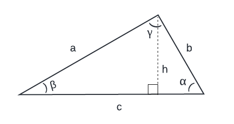</picture>
 <em>Figure 5</em> 

It seems like the one-way speed of light peaks when it is perpendicular to the axis (**b**) through which the speed of light is the standard round-trip value (299,792,458 m/s). Interesting! And this seems to happen regardless of the speed through **c**, although the exact speed at the peak is determined by the speed through **c**.  Can we confirm this with different configurations?

Let's try bringing **b** closer to **h** (see figure 6):
- This should increase the distance required (the length of **c**) for **a** to become perpendicular to **b**.
- Using our original equilateral triangle, let's cut the distance between **b** & **h** in half, giving us a triangle where **a** still has a length of 1, **c** has a length of 0.75, and the angle **β** between them still is 60°.
- We can find the area of this triangle using the standard formula: **A = heigth × base / 2**, giving us **(√3 / 2) × 0.75 / 2 = 0.32476**.
- We can then calculate the new length of **b** using the Pythagorean theorem: **(c - 0.5)2 + h2 = b2**, giving us **(0.25)2 + (√3 / 2)2 = ~0.9**.
- We can also calculate the new angle between **b** & **c** using the law of cosines: **α = cos-1((b2 + c2 - a2) / 2bc)**, giving us: **cos-1((0.8125 + 0.5625 - 1) / 1.35) = ~74°**.
- And we can do the same for the angle between **a** & **b**: **γ = cos-1((a2 + b2 - c2) / 2ab)**, giving us: **cos-1((1 + 0.8125 - 0.5625) / 1.8) = ~46°**.

<picture>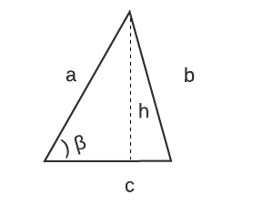</picture>
 <em>Figure 6</em> 

Next, let's make the changes in the equations for our graph (see figure 7):
- Instead of subtracting 0.5 from **c**, we should now subtract 0.25.
- The length & speed of light through **b** are now both 0.9, instead of 1 (although this changes nothing).

<picture>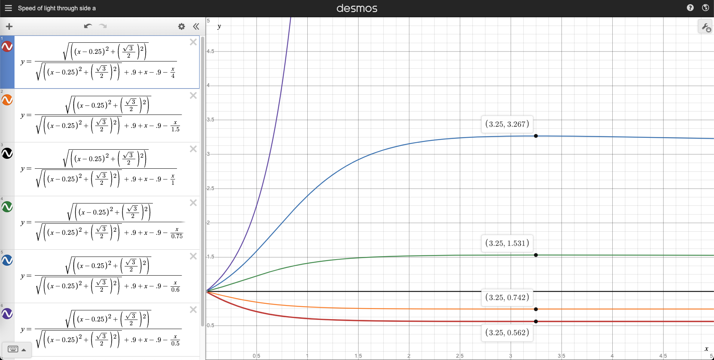</picture>
 <em>Figure 7</em> 

What observations can we make from this graph?

- The peaks happen at **x = 3.25** instead of 2.
  - This is good, and confirms the expectation that a longer length of **c** was required to make **a** perpendicular to **b** and reach the peak speed.

- At **x = 1.625**, the one-way speed of light through **a** is the exact inverse of the one-way speed of light through **c**.
  - Let's determine the length of **a** under those conditions, substituting 1.625 for **x**: **√((1.625 - 0.25)2 + (√3 / 2)2) = 1.625**.
  - This is good, and confirms the expectation that when **a** & **c** are of the same length (forming an isosceles triangle in this case), their speeds should be the inverse of each other within the same circuit (and swapped in the reversed circuit, due to the inversely proportional relationship between them), since the speed of light through **b** has been fixed to 1.
  - And for the purple curve (the last equation), since the speed through **c** has been set to 0.5, the speed through **a** rightly reaches infinity, and appears as an asymptote in the graph.

- As **x** increases (past the peak at **x = 3.25**), the speed of light through **a** gradually gets closer & closer to the inverse of the speed of light through **c**.
  - This is good, and confirms the expectation that as **c** gets longer, and the angle separating them shrinks, **a** become closer & closer to being parallel with it (although it will never be, since **b** will always separate the two), and thus the speed through **a** gradually approaches the inverse of the speed through **c**.

But most importantly, the line in between **a** & **c** when **c = 1.625** is perpendicular to **b** (by definition of an isosceles triangle), and matches the angle at which the peak in speed through **a** is later found.
  - This makes sense, since doubling the length of **c** will lead to reducing the angle it forms with **a** by half, and thus result in **a** becoming parallel with the aforementioned line, and hence becoming perpendicular to **b**.
  - The same thing happened at **c = 1** in the previous graph.
  - And once again, the one-way speed of light peaked when it became perpendicular to **b**.
  - This line between **a** & **c** essentially represents the height of the isoceles triangle.
  - Isoceles triangles are, by definition, symmetrical along the axis of their height.
  - Thus, the one-way speed of light seems to be symmetrical along the axis where it reaches the greatest & lowest speed.

Let's double-check this last statement (about the symmetry of the one-way speed of light along the axis with the greatest & lowest speed) with more unusual examples. Specifically, we want to test the configurations which haven't been explored yet (see figure 8).
- This time, instead of fixing the speed through **b**, let's fix the speed through **c** to 0.75 (except for equation #1).
- Let's have a curve that starts, peaks & remains below 1 (equation #1).
- Let's have curves that start, peak & remain above **y = 1** (equations #5 & #6).
- Let's have curves that start below **y = 1**, then cross over & remain above **y = 1**, and do not peak (equations #3 & #4).
- And finally, let's have a curve that starts below **y = 1**, peaks, and then crosses over & remains above **y = 1** (equation #2).

<picture>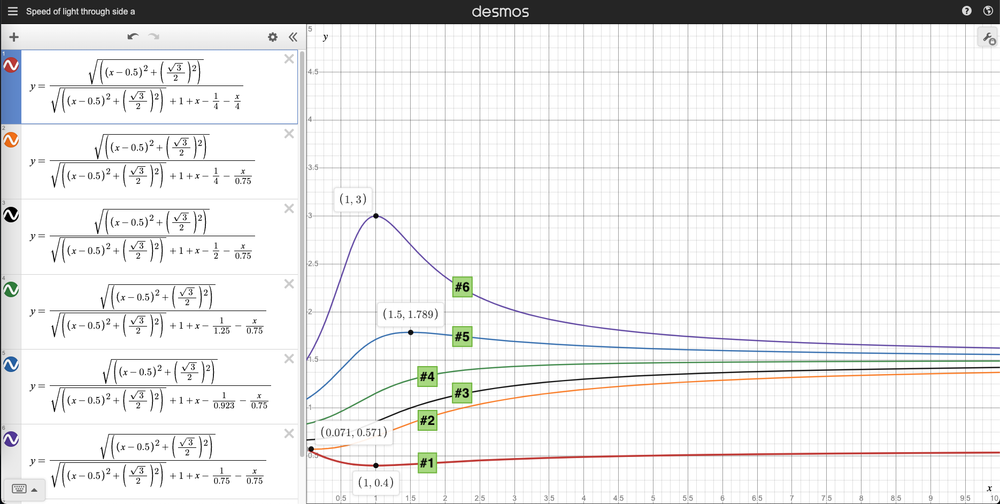</picture>
 <em>Figure 8</em> 

What observations can we make from this graph? We'll skip over some of the repetitive trigonometric calculations so that we can focus on the results:

- The curves of equations #1 & #6 have something in common: they both peak at **x = 1** (when the triangle is equilateral):
  - This is because both of them share a similarity: the one-way speed of light through **b** & **c** is the same in each of them.
  - In the exact middle between **b** & **c** would be the line which is perpendicular to **a** (see figure 1, but using **a** as the base).
  - We already know through the peak in the graph that the one-way speed of light through **a** is either the greatest of the lowest.
  - The resulting assumption would be that the perpendicular speed should be equal to the round-trip speed of light.
  - The triangle formed by the height (**h**), either side **b** or side **c**, and half of **a**, has a perimeter of **1 + 0.5 + √3 / 2 = ~2.366**.
  - And if we subtract the time taken through **b** or **c** and half of **a**, we do obtain **√3/2 = ~0.866**, which is the same as the measurement of the height, which is to say that the one-way speed of light in that direction is equal to the round-trip speed of light.
  - Alternatively, if we add up the time taken through **b** or **c** and half of **a**, we do obtain **1.5**, which is equal to their combined length, which is to say that the combined/average speed through both of those sides is equal to the round-trip speed of light, and thus it must be so for the rest of the circuit as well.

- The curve of equation #5 peaks at **x = 1.5**, which is neither an equilateral nor isosceles triangle, but we can modify it:
  - The length of **c = 1.5**, and thus the length of **a = ~1.32287**, and the angle separating them is **~40.89˚**.
  - To satisfy the round-trip speed of light, we can calculate that the speed through **a = ~1.789**.
  - We can make this a right triangle by increasing the length of **c** to **1.75**, making the length of **b = ~1.1456** (and making it perpendicular to **a**).
  - The time taken through **a** plus the time taken through **c** is equal to their combined length, which means that the speed through **b** (when it is perpendicular to **a**) is equal to the round-trip speed of light.

- The curves of equations #3 & #4 do not have a peak:
  - This is new! But since our transformations on the triangle allow us to explore nearly 120˚ of changes of direction through **a**, we know that we should be able to find at least one of the two perpendicular directions: either the direction where the speed peaks, or the direction where the speed becomes equal to the round-trip speed of light.
  - And indeed, the graph makes this easy for us: when the curve reaches **y = 1**, that is the direction where the one-way speed of light through **a** becomes equal to the round-trip speed of light.
  - For equation #3, that happens at **x = 1.5**, and for equation #4, that happens at **x = 0.6**.
  - For equation #4, that gives us a length of **a = ~0.87178**, and an angle separating it from **c** of **~83.41˚**. Making a right triangle with those parameters gives us a length of **c = ~7.6**, and a length of **b = ~7.546**. At that angle, the speed through **b = ~1.505**, which is the fastest speed available under those conditions. Any other direction will give us a lower speed (see figure 9 for confirmation).
  - For equation #3, that gives us a length of **a = ~1.32287**, and an angle separating it from **c** of **~40.89˚**. This is the same configurations as equation #5, so we know that making a right triangle with those parameters gives us a length of **c = 1.75**, and a length of **b = ~1.1456**. At that angle, the speed through **b = ~2.037**, which is the fastest speed available under those conditions. Any other direction will give us a lower speed (see figure 9 for confirmation).

- Equation #2 also crosses **y = 1** at **x = 2.25**.
  - That gives us a length of **a = ~1.95**, and an angle separating it from **c** of **~26.33˚**. Making a right triangle with those parameters gives us a length of **c = ~2.1786**, and a length of **b = ~0.9663**. At that angle, the speed through **b = ~4.025**, which is the fastest speed available under those conditions. Any other direction will give us a lower speed (see figure 9 for confirmation).
  - Moreover, this curve also has a peak at **x = 0.071**, where the speed through **a** is **~0.571**, which should be the slowest speed, and the inverse of the fastest speed through **b** (see above). If we use the equation to inverse the speed, we do in fact get this result: **1 / (2 - 1/4.025) = ~0.571**.
  - As expected, going through the trigonometry also reveals the same results: the speed through the line that is perpendicular to **a** is equal to the round-trip speed of light.

We can confirm the results above (when **y = 1**) by graphing the respective curves with the triangle being reversed (see figure 9):
  - This effectively swaps sides **a** & **b**.
  - And we can adjust the offset for side **c** in the equations from **0.5** to the value on the other side of **h**.
    - For equation #4, where the length of **c = 0.6**, the offset should become **0.1** instead of **0.5**.
    - For equation #3, where the length of **c = 1.5**, the offset should become **1** instead of **0.5**.
    - For equation #2, where the length of **c = 2.25**, the offset should become **1.75** instead of **0.5**.
  - The result of these equations should show that the speed through **b** peaks when **x** (the length of **c**) reaches the value caculated previously.
  - And inverting the speed through **c** (**1.5** instead of **0.75**) should likewise inverse the peak speed through **b**.
  - As we can see in the graph below (see figure 9), all these expectations are verified:
    - For equation #4, we had calculated a length of **c = ~7.6**, and a speed through **b** of **~1.505**. The inverse of that speed is **~0.749**.
    - For equation #3, we had calculated a length of **c = 1.75**, and a speed through **b** of **~2.037**. The inverse of that speed is **~0.663**.
    - For equation #2, we had calculated a length of **c = ~2.1786**, and a speed through **b** of **~4.025**. The inverse of that speed is **~0.571**.

<picture>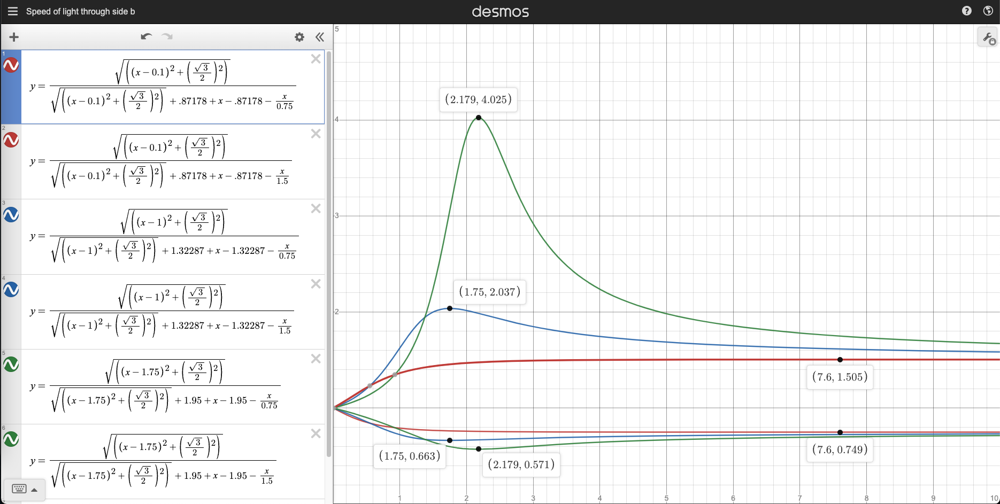</picture>
 <em>Figure 9</em> 

### Symmetrical results

This clearly demonstrates the symmetrical nature of the trigonometric relationship implied by the round-trip speed of light, which makes sense since the laws of angles & trigonometry themselves imply symmetry when combined with any kind of proportional relationship:
- The speeds in opposite directions are inversely proportional. Thus, the round-trip time around a circuit is always the same in both directions (it takes just as long to travel a circuit in one direction or the other).
- All opposite angles are equal, thus dimensions must remain proportional in a way that preserves the round-trip time/inverse proportionality of the speed.
  - It logically follows that there needs to exist a 0˚ axis across which the values of the cosine function are symmetrical, and thus proportional triangles on both sides of this axis would be symmetrical as well.
- It follows that in order to complete a circuit with a direction that is perpendicular to a direction in another given circuit of the same length (the other two directions being either the same or the inverse) *in the same amount of time*, the speed in that perpendicular direction must be either:
  - The same speed.
  - Or somewhere in between the higher & lower speeds that are perpendicular to it (or vice versa).
- And it follows that by rotating this system, we will eventually reach a configuration where the speed in the perpendicular axis is the same as its inverse (**1 / (2 - 1/1) = 1**), and the axis perpendicular to that one will be the symmetrical axis (the one with the greatest & lowest speed).

#### Can we break the symmetry?

Figure 10 below shows a basic attempt at breaking the symmetry described above: the speeds are inversely proportional, but not symmetric across the vertical axis. The circuits on the right reveal the result: in order not to break the round-trip speed of light, the one-way speed of light in the vertical axis must be equal in both directions (i.e. the round-trip speed). We've merely swapped the axes! The horizontal axis is actually the symmetric one.

You can try changing the speeds or the angles/directions, but as we've demonstrated above, this will always result in two perpendicular axes: a symmetric axis and an inversely proportional axis.

<picture>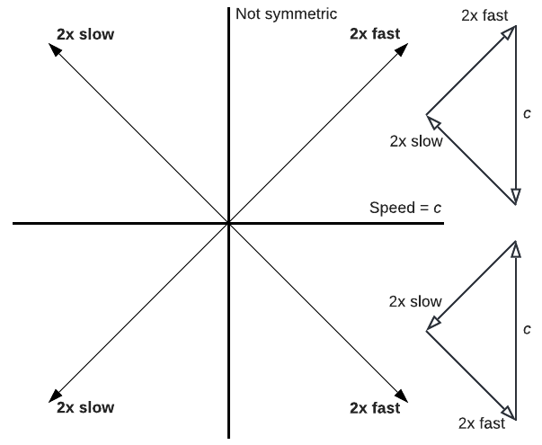</picture>
 <em>Figure 10</em> 

Figure 11 below shows what happens when we try to break those rules with an arbitrary speed, and how to fix it:
- The arrows represent the speed in the given direction (longer = faster).
- The subtyped **i** represents the inverse speed (relative to the opposite direction). For example, **s1i** is the inverse of **s1**.
- In the first configuration, the speed through **s4** is too high, and we can very easily see how **s2i** & **s3** are not fast enough to complete the cirtuit. Inversely, **s2** & **s3i** are too fast for the cirtuit they form with **s4i**. Thus, this is an invalid configuration as it violates the round-trip speed of light.
- The second configuration fixes the issue by setting **s4** & **s4i** to the same speed (which is a speed somewhere in between **s1** & **s1i** in the perpendicular axis, as per the rules above), which makes **s1** the greatest speed & **s1i** the lowest (along the symmetrical axis). Thus, **s2** & **s3** are symmetrical (they have the same speed).
  - Note that the scale isn't perfect here, as **s1i** should be the shortest arrow, and **s1** should be longer. But it is sufficient for demonstration purposes.
- The third configuration fixes the issue by setting **s4** to the same speed as  **s1** (as per the rules above), which makes the direction in between them the symmetrical axis, with **s3** having the greatest speed, and its opposite (**s3i**) the lowest. The axis perpendicular to **s3** (**s2**) has the same speed in both directions.

<picture>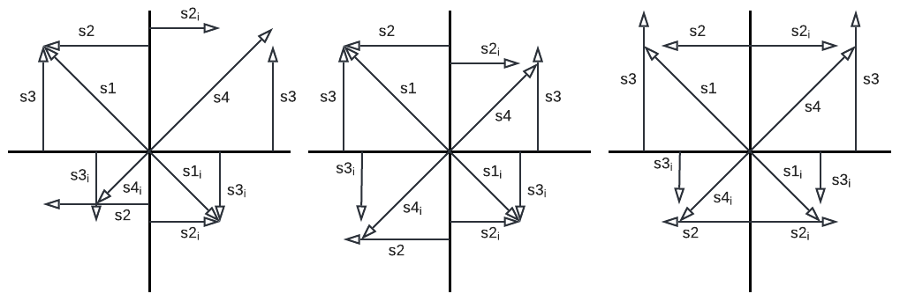</picture>
 <em>Figure 11</em> 

Figure 12 shows the final representation of this system as it applies to the one-way speed of light:

<picture>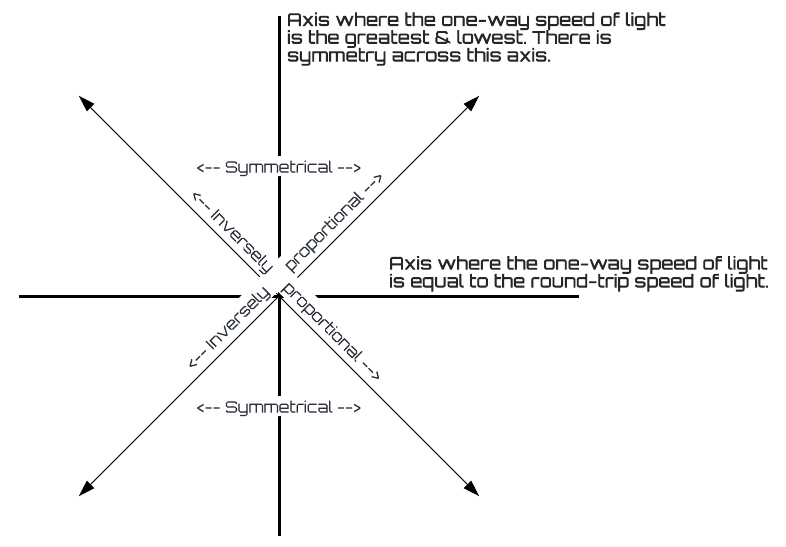</picture>
 <em>Figure 12</em> 

### Conclusion
We've been able to observe two important & perpendicular axes:

- One axis where the one-way speed of light reaches the greatest & lowest speed, and across which all other speeds are symmetrical (by virtue of the trigonometric relationship implied by the round-trip speed of light).

- And another axis where the one-way speed of light is equal to the round-trip speed of light (by virtue of the inverse proportionality of the round-trip speed of light combined with the symmetry of the perpendicular axis).
  - In a three-dimensional space, this axis would instead become an entire plane.

As a result, if we were to graph the one-way speed of light (or the time taken by light to travel a fixed distance) in all the directions of a given plane, the dimensions could be trigonometrically calculated from these two axes (see figure 13).

<picture>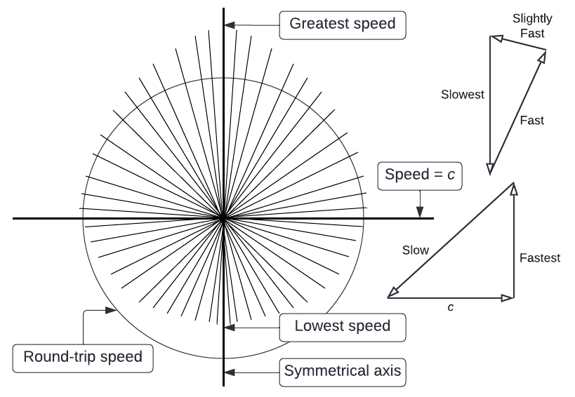</picture>
 <em>Figure 13</em> 

And if we were to graph the one-way speed of light (or the time taken by light to travel a fixed distance) in all 3-dimensional directions, we would obtain one of two shapes:

- If the one-way speed of light is the same in every direction, we would obtain a perfect sphere (like a ping-pong ball).

- Otherwise, we would obtain an ovoid (the shape of an egg):
  - One plane would show a perfect sphere: that is the plane where the one-way speed of light is equal to the round-trip speed of light.
  - And the axis perpendicular to that plane would show an elongation on one side, and a compression on the other: that is the axis with the greatest & lowest one-way speed of light.

***This should be the result of any system which mixes a proportional relationship with a trigonometric relationship.*** There are no surprise/magical directions where the speed is unexpected or couldn't be calculated using this model; otherwise, it would break the two mains laws of physics stated in the introduction & used throughout this document:
- The time taken by the one-way speed of light to travel around any circuit must be equal to the time taken by the round-trip speed of light to travel around that same circuit.
- Hence, the one-way speed of light going in exactly opposite directions must be inversely proportional.

Magical directions where light is suddenly going faster or slower would violate the round-trip speed of light:
  - Putting those magical directions end-to-end would result in a "secret path" where light can arrive at its destination faster or slower than by using any other path with the same source, destination, and length (but different directions).
  - Forming a circuit with those magical directions would result in a travel time that is shorter or longer than that of the round-trip speed of light.
  - It would also create a triangle where the length of the arms does not correspond with the length of the hypothenuse (at the given angles/directions), which is a mathematical impossibility.
  - Such results have never been achieved (and rightfully so).

Thus, the oval/ovoid shape described above must always arise, because it is simply a result of the trigonometric distribution of the speed. Any measurements that do not conform to this model/distribution could most likely be discarded as instrumental errors or environmental perturbations, or otherwise prompt some serious investigation (especially if they can be replicated).

Figure 14 below provides an example of such erroneous measurements over a given plane. The lines represent the direction of each measurements, and their length represents the one-way speed of light in that direction (longer = faster). The circle represents the round-trip speed of light.

<picture>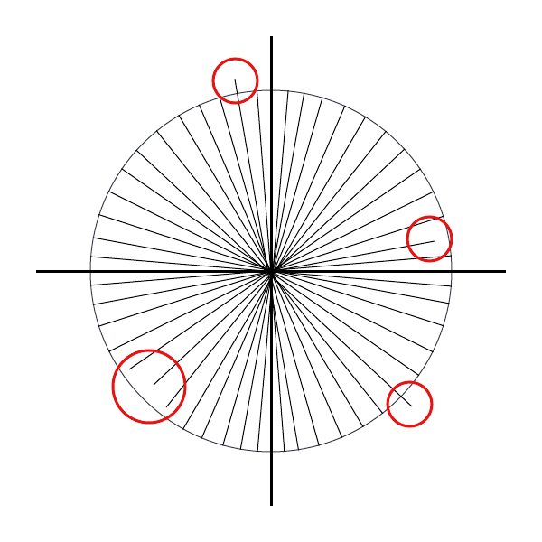</picture>
 <em>Figure 14</em> 

Thus, given the relative one-way speed of light in two perpendicular directions (separated by 90˚), we can determine that:

- If one of the relative speeds is 1, then that speed is equal to the round-trip speed of light, and the other speed is either the greatest or lowest (in that plane).

- If both one-way speeds are greater than a relative speed of 1, the interval between them contains the direction with the greatest one-way speed (in that plane).
  - And if both one-way speeds are exactly the same (even if separated by more or less than 90˚), then the direction with the greatest one-way speed is in the exact center between the two.

- Conversely, if both one-way speeds are lower than a relative speed of 1, the interval between them contains the direction with the lowest one-way speed (in that plane).
  - And if both one-way speeds are exactly the same (even if separated by more or less than 90˚), then the direction with the lowest one-way speed is in the exact center between the two.

- And if one of the two speeds is greater than 1 while the other is lower, then the interval between them contains a direction/axis where the one-way speed of light is exactly the same as the round-trip speed of light.
  - And if both one-way speeds are inversely proportional (even if separated by more or less than 90˚), then the direction where the one-way speed of light is exactly the same as the round-trip speed of light is in the exact center between the two.

As a result, it should be possible to mathematically calculate the one-way speed of light in every direction of a given plane using two perpendicular measuring devices, and in every three-dimentional directions using three perpendicular measuring devices (see figure 15). Calculating the inverse of those speeds would also give us their value in the opposite direction, but we could also install measuring devices in those directions in order to confirm this.

<picture>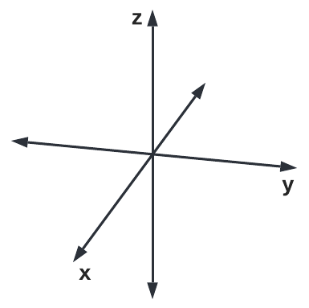</picture>
 <em>Figure 15</em> 

Best of all: three perpendicular measuring devices would very quickly provide certainty on whether or not the one-way speed of light varies at all. It would be like measuring the radius of an egg in three perpendicular directions: we are guaranteed to get at least one measurement that differs from the others, and very likely to get three completely different measurements. But if all three measurements always remain the same, we are dealing with a sphere.

<picture>
  
</picture>
<picture>
  
</picture>
